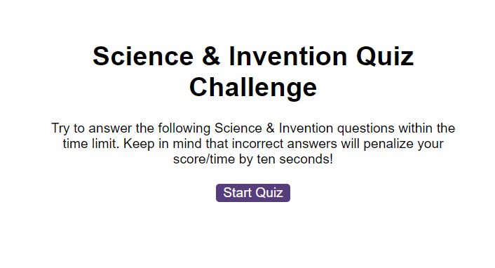

# Ben-Sadler-Multiple-Choice-Quiz

## Description 

This challenge requires creating a in browser interactive Multi choice quiz, it provides opportunity to demonstrate understanding in APIs.

To be complete.

<ins>User Story</ins>  

AS A coding boot camp student
I WANT to take a timed quiz on JavaScript fundamentals that stores high scores
SO THAT I can gauge my progress compared to my peers

<ins>The Acceptance Criteria </ins>  

Create a code quiz that contains the following requirements:

* A start button that when clicked a timer starts and the first question appears.
 
  * Questions contain buttons for each answer.
  * 
  * When answer is clicked, the next question appears
  * 
  * If the answer clicked was incorrect then subtract time from the clock

* The quiz should end when all questions are answered or the timer reaches 0.

  * When the game ends, it should display their score and give the user the ability to save their initials and their score

<strong>Links</strong>

Website: https://bena251.github.io/Ben-Sadler-Multiple-Choice-Quiz/  
Website Repository: https://github.com/BenA251/Ben-Sadler-Multiple-Choice-Quiz

## Usage 
To be complete

<strong>Console Screenshot:</strong>  

## Credits

Challenge/Project Material was provided by course. 

## License

MIT license

© 2023 edX Boot Camps LLC. Confidential and Proprietary. All Rights Reserved.
